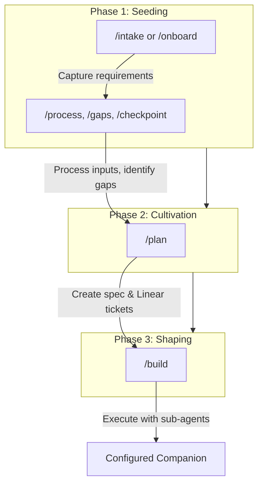
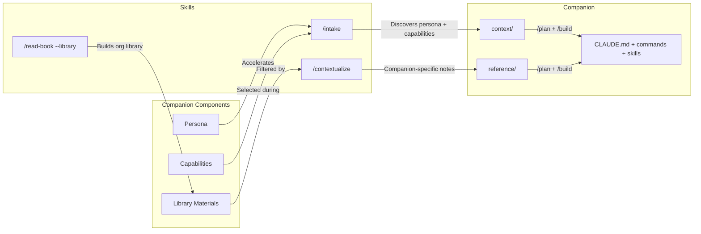

# Project Creator

```
git clone git@github.com:Consortium-team/project-creator.git
```

**The challenge:** Creating an effective AI companion requires capturing tacit knowledge — requirements, constraints, architectural decisions, workflow patterns — that lives in your head. Without systematic extraction, companions start incomplete, context gets lost, and teams can't scale what individuals discover.

**The solution:** Project Creator creates AI companions — Claude Code projects composed from reusable personas, capabilities, and domain knowledge. It uses reverse prompting to draw out your requirements through structured conversation, then generates the Claude Code configuration artifacts: `CLAUDE.md`, `README.md`, skills, and agents. You seed requirements, cultivate them into an implementation plan, then shape the final companion — transforming ad-hoc setup into repeatable, scalable companion creation.

---

## Setup

**When you're done with setup, you'll have:**
- Companion Workbench — a desktop app for managing and running companions
- Knowledge Workbench — a desktop app for browsing and exploring your knowledge library
- A Project Creator directory connected to both, ready to create your first companion

**Time needed:** About 45 minutes for first-time setup.

### Phase 1: Prerequisites

Before you can use Project Creator, you'll need to install a few tools. This section walks you through each one step by step.

---

#### 1.1 Open a Terminal

A terminal is a text-based way to give your computer instructions. You'll type (or paste) commands and press Enter to run them. Throughout this guide, when we say "paste this into your terminal," we mean: copy the text, click inside the terminal window, paste, and press Enter.

<details>
<summary><strong>macOS</strong></summary>

Press **Cmd + Space** on your keyboard. A search bar appears in the center of your screen — this is called Spotlight. Type `Terminal` and press **Enter**.

A window will open with a blinking cursor. This is your terminal. You'll use it for many of the steps in this guide.

**Keep it handy:** Right-click the Terminal icon that appeared in your Dock (the bar of icons at the bottom of your screen) and select **Options > Keep in Dock**. That way you can click it anytime instead of searching again.

</details>

<details>
<summary><strong>Windows</strong></summary>

Windows doesn't come with the right kind of terminal for this guide, but you'll get one automatically when you install Git in the next step. After installing Git (step 1.2), you'll use an app called **Git Bash** as your terminal.

For now, just move on to step 1.2.

</details>

---

#### 1.2 Install Git

Git is a tool that tracks changes to files — like a detailed undo history for your entire project. You'll need it to download Project Creator and to save your work.

<details>
<summary><strong>macOS</strong></summary>

In your Terminal window, paste this and press Enter:

```bash
git --version
```

One of two things will happen:

**You see a version number** (something like `git version 2.39.0`) — Git is already installed. You're done with this step.

**A popup appears asking to install "Command Line Developer Tools"** — This is normal. Click **Install**. A progress bar will appear — this download can take 5-10 minutes depending on your internet speed. When it finishes, click **Done**.

After the install finishes, go back to your Terminal and run the same command again to confirm:

```bash
git --version
```

You should now see a version number.

</details>

<details>
<summary><strong>Windows</strong></summary>

1. Open your web browser and go to [git-scm.com/downloads/win](https://git-scm.com/downloads/win)
2. The download should start automatically. If it doesn't, click the download link for **64-bit Git for Windows Setup**
3. Find the downloaded file (usually in your Downloads folder) and double-click it to run the installer
4. **Click Next on every screen** — the default options are fine. Don't change anything. Just keep clicking Next until you reach **Install**, then click that too.
5. When installation finishes, click **Finish**

Now open your terminal. Click the **Start** button (the Windows icon in the bottom-left corner of your screen), type `Git Bash`, and click the app that appears. A dark window with a blinking cursor will open — this is your terminal for the rest of this guide.

**Keep it handy:** Right-click the Git Bash icon in your taskbar (the bar at the bottom of your screen) and select **Pin to taskbar**.

Verify Git is installed by pasting this into Git Bash and pressing Enter:

```bash
git --version
```

You should see a version number (like `git version 2.47.0`).

</details>

---

#### 1.3 Install Claude Code

Claude Code is the AI engine that powers your companions. You'll install it using a command in your terminal.

For the full reference, see [code.claude.com/docs](https://code.claude.com/docs). The install commands are below.

<details>
<summary><strong>macOS</strong></summary>

Paste this into your Terminal and press Enter:

```bash
curl -fsSL https://claude.ai/install.sh | bash
```

You'll see a lot of text scroll by — that's normal. The installer is downloading and setting up Claude Code.

**Important — look for a line that starts with `echo`.** Near the end of the output, you may see a line that looks something like this:

```
echo 'export PATH="/Users/yourname/.claude/bin:$PATH"' >> ~/.zshrc
```

**Do not copy the example above — it won't work for you.** The line in YOUR terminal will have your actual username and file paths. Find the `echo` line in your own terminal output, select and copy that one, paste it back into your terminal, and press Enter. This tells your computer where to find Claude Code. If you skip this step, the Companion Workbench and Knowledge Workbench won't be able to find Claude later.

After running the `echo` line, **close your Terminal window and open a new one** (Cmd+Space, type `Terminal`, press Enter). This is needed for the change to take effect.

In the new Terminal window, verify Claude Code is installed:

```bash
claude --version
```

You should see a version number. **If you see "command not found"**, go back and make sure you ran the `echo` line and opened a new Terminal window.

The first time you run `claude`, you'll be asked to log in to your Anthropic account. Follow the prompts in your browser to complete this.

</details>

<details>
<summary><strong>Windows</strong></summary>

Paste this into Git Bash and press Enter:

```bash
curl -fsSL https://claude.ai/install.sh | bash
```

You'll see a lot of text scroll by — that's normal. The installer is downloading and setting up Claude Code.

**Important — look for a line that starts with `echo`.** Near the end of the output, you may see a line that looks something like this:

```
echo 'export PATH="/c/Users/yourname/.claude/bin:$PATH"' >> ~/.bashrc
```

The exact text will be different for you — that's fine. **You need to run this line.** Copy the entire `echo '...'` line, paste it into Git Bash, and press Enter. This tells your computer where to find Claude Code. If you skip this step, the Companion Workbench and Knowledge Workbench won't be able to find Claude later.

After running the `echo` line, **close your Git Bash window and open a new one** (Start menu, type `Git Bash`). This is needed for the change to take effect.

In the new Git Bash window, verify Claude Code is installed:

```bash
claude --version
```

You should see a version number. **If you see "command not found"**, go back and make sure you ran the `echo` line and opened a new Git Bash window.

The first time you run `claude`, you'll be asked to log in to your Anthropic account. Follow the prompts in your browser to complete this.

</details>

---

#### 1.4 Create a GitHub Account

GitHub is where your companion code will be stored online. If you already have a GitHub account, skip to step 1.5.

1. Go to [github.com](https://github.com) in your browser
2. Click **Sign up**
3. Follow the prompts to create a free account
4. Verify your email address when GitHub sends you a confirmation email

---

#### 1.5 Set Up SSH Keys

SSH keys are like a secret handshake between your computer and GitHub. Instead of typing your password every time you upload or download code, your computer proves who it is automatically.

You'll create a key pair — a private key (stays on your computer, never share it) and a public key (you give this to GitHub).

<details>
<summary><strong>macOS</strong></summary>

**Create the key pair.** Paste this into your Terminal — replace `your-email@example.com` with the email you used for your GitHub account:

```bash
ssh-keygen -t ed25519 -C "your-email@example.com"
```

You'll see three prompts. **Press Enter on each one without typing anything:**

1. **"Enter file in which to save the key"** — Just press Enter.
2. **"Enter passphrase"** — Just press Enter (leave it empty — no password needed).
3. **"Enter same passphrase again"** — Just press Enter again.

**Give GitHub your public key.** Run this to copy your public key to your clipboard:

```bash
cat ~/.ssh/id_ed25519.pub | pbcopy
```

Nothing will appear to happen — that's normal. Your key has been copied and is ready to paste.

Now go to [github.com/settings/keys](https://github.com/settings/keys) in your browser:

1. Click the green **New SSH key** button
2. **Title:** type something like `My Mac`
3. **Key:** click in the big text box and paste (**Cmd+V**)
4. Click **Add SSH key**
5. GitHub may ask you to confirm your password

</details>

<details>
<summary><strong>Windows</strong></summary>

**Create the key pair.** Paste this into Git Bash — replace `your-email@example.com` with the email you used for your GitHub account:

```bash
ssh-keygen -t ed25519 -C "your-email@example.com"
```

You'll see three prompts. **Press Enter on each one without typing anything:**

1. **"Enter file in which to save the key"** — Just press Enter.
2. **"Enter passphrase"** — Just press Enter (leave it empty — no password needed).
3. **"Enter same passphrase again"** — Just press Enter again.

**Give GitHub your public key.** Run this to copy your public key to your clipboard:

```bash
cat ~/.ssh/id_ed25519.pub | clip
```

Nothing will appear to happen — that's normal. Your key has been copied and is ready to paste.

Now go to [github.com/settings/keys](https://github.com/settings/keys) in your browser:

1. Click the green **New SSH key** button
2. **Title:** type something like `My Windows PC`
3. **Key:** click in the big text box and paste (**Ctrl+V**)
4. Click **Add SSH key**
5. GitHub may ask you to confirm your password

</details>

---

#### 1.6 GitHub Organization

An organization is a shared space on GitHub where all your companion code will live. Think of it like a folder for your projects on GitHub.

**If your company already has a GitHub organization**, you don't need to create a new one. Contact your company's GitHub administrator and ask them to invite you to the organization. Once you've accepted the invitation, you're done with this step.

**If you need to create a new organization:**

1. Go to [github.com/organizations/plan](https://github.com/organizations/plan) in your browser
2. Under the **Free** option, click **Create a free organization**
3. **Organization account name:** We recommend `[yourname]-companions` (for example, `jane-companions`)
4. **Contact email:** Use your email address
5. Choose **My personal account** when asked who the organization belongs to
6. Follow the remaining prompts — you can skip adding other people for now

---

#### Checkpoint: Verify Everything Connects

Let's make sure your computer can talk to GitHub. In your terminal (Terminal on macOS, Git Bash on Windows), paste this and press Enter:

```bash
ssh -T git@github.com
```

**If this is the first time connecting**, you'll see a message asking "Are you sure you want to continue connecting?" Type `yes` and press Enter.

You should then see: `Hi [your-username]! You've successfully authenticated, but GitHub does not provide shell access.`

That message means everything is working. The "does not provide shell access" part is normal — it's just GitHub confirming your identity.

**If you see "Permission denied"**, go back and check steps 1.5 (SSH keys). The most common issue is that the public key wasn't pasted correctly into GitHub.

---

### Phase 2: Project Creator

#### 2a. Choose a Home Directory

First, decide where on your computer you want to keep Project Creator and your knowledge files. We recommend your **Documents** folder. In your terminal, navigate there:

**macOS:**
```bash
cd ~/Documents
```

**Windows (Git Bash):**
```bash
cd ~/Documents
```

`cd` means "change directory" — it's how you move to a different folder in the terminal. Everything you do next will happen inside Documents.

#### 2b. Clone the Repository

Now download Project Creator. Paste this into your terminal and press Enter:

```bash
git clone git@github.com:Consortium-team/project-creator.git
```

**The first time you connect to GitHub**, you'll see a message like this:

```
The authenticity of host 'github.com' can't be established.
ED25519 key fingerprint is SHA256:+DiY3wv...
Are you sure you want to continue connecting (yes/no/[fingerprint])?
```

**You must type `yes` and press Enter.** Don't just press Enter — the default is "no" and the clone will fail. Type the word `yes`.

After that, Git will download the project. When it finishes, you'll have a `project-creator` folder inside your Documents folder.

#### 2c. Create Your Knowledge Directory

This is where your knowledge library files will live. Create it next to the project-creator folder:

```bash
mkdir -p ~/Documents/knowledge
```

You now have two folders inside Documents:
- `Documents/project-creator/` — the Project Creator system
- `Documents/knowledge/` — your knowledge library

#### Checkpoint

Let's verify the clone worked. Paste this into your terminal:

```bash
ls ~/Documents/project-creator/CLAUDE.md
```

You should see the file path printed back to you. If you see "No such file or directory," the clone in step 2b may not have completed — try running the `git clone` command again from step 2b.

---

### Phase 3: Companion Workbench

The Companion Workbench is a desktop app for managing companions and running Claude Code sessions.

#### 3a. Download and Install

<details>
<summary><strong>macOS</strong></summary>

1. Download the Companion Workbench installer: **[Companion Workbench for macOS](https://github.com/Consortium-team/project-creator/releases/download/workbench-v0.1.0/Companion.Workbench-0.1.0-arm64.dmg)**

   > **Older Mac?** If your Mac is from before 2020 (Intel processor instead of Apple Silicon), you may need a different version. Check the [releases page](https://github.com/Consortium-team/project-creator/releases) for an x64 build.

2. Find the downloaded file — it will be in your Downloads folder, named something like `Companion.Workbench-0.1.0-arm64.dmg`. Double-click it to open.

3. A window will appear showing the Companion Workbench icon and an Applications folder. **Drag the Companion Workbench icon onto the Applications folder.** This copies the app to your computer.

4. Close the installer window.

5. Open the app: go to your Applications folder (in Finder, click **Go > Applications** in the menu bar), find **Companion Workbench**, and **right-click it** (or hold the Control key and click it). Select **Open** from the menu that appears.

   > **Why right-click?** macOS blocks apps from unrecognized developers on first launch. Right-clicking and choosing Open tells macOS you trust this app. You only need to do this once — after the first time, you can open it normally by double-clicking.

6. If you see a dialog asking "Are you sure you want to open it?", click **Open**.

</details>

<details>
<summary><strong>Windows</strong></summary>

1. Download the Companion Workbench installer: **[Companion Workbench for Windows](https://github.com/Consortium-team/project-creator/releases/download/workbench-v0.2.0/Companion.Workbench-0.2.0-x64-setup.exe)**

2. Find the downloaded file — it will be in your Downloads folder, named something like `Companion.Workbench-0.2.0-x64-setup.exe`. Double-click it to run.

3. **Windows SmartScreen may show a warning** — a blue window that says "Windows protected your PC." This is normal for new apps. Click **More info**, then click **Run anyway**.

4. Follow the installer prompts — the defaults are fine, just keep clicking **Next** until it finishes.

5. The app should launch automatically after installation. If it doesn't, find **Companion Workbench** in your Start menu and click it.

</details>

#### 3b. Configure Project Creator Directory

When Companion Workbench opens for the first time, it will ask you to choose your Project Creator directory. This is the folder you downloaded in Phase 2.

1. Click the **Choose Directory** button (or similar — the exact wording may vary)
2. Navigate to your **Documents** folder
3. Select the **project-creator** folder inside it
4. Click **Choose** (or **Select Folder** on Windows)

#### 3c. Run First-Time Configuration

Now you need to run the Project Creator setup inside Companion Workbench.

1. Look at the navigation tree on the left side of the window. Move your mouse over **Project Creator** and click on it.

2. When you hover over Project Creator, you'll see three small colored buttons appear — **green**, **yellow**, and **red**. These control how much permission Claude has. **Click the yellow button.** (Yellow gives Claude enough permissions to set things up without needing to ask you for approval on every step.)

3. A terminal session will open on the right side of the window. You'll see text start to appear — Claude is starting up.

4. **If this is your first time using Claude Code**, Claude will ask you some introductory questions before you can start — things like agreeing to terms and selecting preferences. Read each prompt and follow the instructions until Claude is ready and waiting for your input. You'll know it's ready when you see a blinking cursor where you can type.

5. Once Claude is ready, type this and press Enter:

```
/configure
```

6. Follow the prompts — Claude will walk you through setting up your default organization and verifying your environment. Answer the questions as they come up.

#### Checkpoint

You should see the Companion Workbench window with a navigation tree on the left side. The tree may be mostly empty — that's fine, you haven't created any companions yet. You should also be able to open a terminal session and interact with Claude.

If the app asked you to choose a directory and then nothing happened, try closing and reopening the app. If you see an error message, double-check that you selected the `project-creator` folder (not the `Documents` folder itself).

---

### Phase 4: Knowledge Workbench

The Knowledge Workbench is a desktop app for browsing your knowledge library — rendered markdown, PDFs, diagrams, and more.

#### 4a. Download and Install

<details>
<summary><strong>macOS</strong></summary>

1. Download the Knowledge Workbench installer: **[Knowledge Workbench for macOS](https://github.com/Consortium-team/project-creator/releases/download/knowledge-workbench-v1.0.1/Knowledge.Workbench-1.0.1-arm64.dmg)**

   > **Older Mac?** Same as Companion Workbench — if your Mac is from before 2020, check the [releases page](https://github.com/Consortium-team/project-creator/releases) for an x64 build.

2. Double-click the downloaded `.dmg` file to open it.

3. **Drag the Knowledge Workbench icon onto the Applications folder**, just like you did with Companion Workbench.

4. Close the installer window.

5. Open the app: find **Knowledge Workbench** in your Applications folder, **right-click it**, and select **Open**. Click **Open** again if prompted.

   > Just like Companion Workbench, you only need to right-click the first time.

</details>

<details>
<summary><strong>Windows</strong></summary>

1. Download the Knowledge Workbench installer: **[Knowledge Workbench for Windows](https://github.com/Consortium-team/project-creator/releases/download/knowledge-workbench-v1.0.1/Knowledge.Workbench-1.0.1-x64-setup.exe)**

2. Double-click the downloaded `.exe` file to run it.

3. **If SmartScreen appears**, click **More info** then **Run anyway** (same as Companion Workbench).

4. Follow the installer prompts — defaults are fine.

5. The app should launch automatically. If not, find **Knowledge Workbench** in your Start menu.

</details>

#### Checkpoint

Knowledge Workbench should open and show your project-creator directory contents in the navigation tree. It automatically finds your Project Creator directory using the configuration that Companion Workbench created in Phase 3.

If you see an error about not finding the Project Creator directory, make sure Companion Workbench (Phase 3) is fully set up and was opened at least once.

---

### Phase 5: Knowledge Explorer

The Knowledge Explorer is a companion that runs inside Knowledge Workbench. It gives Knowledge Workbench the ability to process and organize your knowledge library using Claude.

#### 5a. Set Up Knowledge Domains

First, tell Knowledge Workbench where your knowledge files live. You'll add the knowledge directory you created in Phase 2.

1. In Knowledge Workbench, look for a **"+"** button or **domain management** area in the navigation tree on the left
2. Add a new domain:
   - **Name:** `knowledge`
   - **Directory:** navigate to your **Documents** folder and select the **knowledge** folder you created in Phase 2

#### 5b. Download Knowledge Explorer

1. Open Knowledge Workbench (if it isn't already open).

2. Look in the right panel where the terminal would normally be. Instead of a terminal, you'll see **instructions for downloading the Knowledge Explorer**, including a command you need to copy and paste.

3. Open your regular terminal (Terminal on macOS, Git Bash on Windows — the same one you used in Phase 1).

4. Copy the command from the Knowledge Workbench instructions, paste it into your regular terminal, and press Enter. Git will download the Knowledge Explorer.

5. Go back to Knowledge Workbench. You may need to **close and reopen it** for the Knowledge Explorer to appear. After reopening, you should see the right panel now has the ability to open a terminal session.

#### 5c. Configure Knowledge Explorer

1. In Knowledge Workbench, open a terminal session in the right panel
2. Type the following and press Enter:

```
/configure
```

3. The Knowledge Explorer will ask you some setup questions. Follow the prompts — when it asks if the knowledge directory should be used as the write target, type **yes** and press Enter.

#### Checkpoint

You should be able to:
- See folders in the navigation tree on the left
- Click a markdown file and see it rendered (formatted) in the middle pane
- Open a terminal session in the right pane

If the terminal shows "command not found" or won't start, go back to Phase 1 step 1.3 and make sure the Claude Code `echo` step was completed and you opened a new terminal window afterward.

---

## Quick Start: Using Claude Cowork Tasks

We recommend Cowork tasks for the conversational phases (gathering requirements, planning) and Claude Code for the build phase. Cowork's conversational interface is well-suited for the back-and-forth of requirements gathering.

### Setting Up a Cowork Task

1. When creating a Cowork task, click the button to set working folders
2. Set the working folder to your `project-creator` directory

### Starting a Companion

Your first message should tell Claude to orient itself as the project creator:

> We're going to be creating a companion project. First, let's make sure you've set yourself up as the project creator. Look at the `CLAUDE.md` in this working directory and make sure you understand it. Then look in the `.claude` folder so you see the local commands, agents, and skills available for you to use.

The key elements:
- **State what you're doing** — Give Claude the high-level goal
- **Direct it to read `CLAUDE.md`** — This is the project configuration
- **Direct it to read `.claude/`** — This is where skills, agents, and rules live

After Claude confirms it has oriented itself, you can use commands normally.

### Example Workflow

**Create a companion:**
> Run the `/companion` command to create a new companion in `my-org` and call it `my-first-companion`.

**Start the intake conversation:**
> Please run the `/intake` command.

Claude will ask you questions one at a time to understand what you want your companion to do. Answer naturally — don't worry about structure.

**Check progress:**
> Run the `/gaps` command and see how we're doing.

**Create the plan:**
> Please run the `/plan` command. I'm not saying do the things that you think the plan should do — actually run the command so that we're following the disciplined steps that it takes.

Note the explicit instruction to run the command. In Cowork tasks, Claude sometimes interprets a request like "plan this" as permission to improvise rather than follow the defined steps.

**Run the build (switch to Claude Code for this):**
> Please run the `/build` command.

---

## Quick Start: Using Claude Code Directly

```bash
# Point Claude Code at the project-creator directory
cd project-creator
claude

# First time using
/configure

# Create a new companion
/companion new my-org/my-companion

# Start the intake conversation
/intake                         # General intake
/intake product-manager         # Or specify a persona

# (Answer questions as Claude draws out your requirements)

# Check what's still needed
/gaps

# End your session
/checkpoint
```

### Onboarding an Existing Companion

```bash
# Clone your existing companion into companions/
git clone <repo-url> companions/my-org/existing-companion

# Set it as current
/companion my-org/existing-companion

# Analyze and fill gaps
/onboard
```

### Continuing Work

```bash
# Set your companion
/companion my-org/my-companion

# See where you left off
/gaps

# Continue capturing
/intake

# End session
/checkpoint
```

---

## What's New

[v2.0 — Three-Layer Architecture](docs/release-notes.md) — Companions are now more reliable and token-efficient. Instructions are distributed across a reliability hierarchy so the right guidance shows up at the right time.

---

## Workflow Overview



---

## The Three Phases

Companion creation happens in phases:

| Phase | Focus | Commands |
|-------|-------|----------|
| **Setup** | First-time configuration | `/configure` |
| **Seeding** | Capture requirements and context | `/companion`, `/intake`, `/onboard`, `/process`, `/gaps`, `/checkpoint`, `/read-book`, `/contextualize` |
| **Cultivation** | Create implementation plan | `/plan` |
| **Shaping** | Execute plan with sub-agents | `/build` |

### Phase 1: Seeding

Capture enough context that a well-configured Claude Code project can be generated.

| Command | Purpose |
|---------|---------|
| `/intake` | New companion reverse prompting |
| `/onboard` | Existing companion analysis |
| `/process` | Handle external inputs (transcripts, docs) |
| `/gaps` | Assessment checkpoint |
| `/checkpoint` | Session capture |
| `/read-book` | Read and annotate a book via Kindle Cloud Reader |
| `/contextualize` | Generate companion-specific reference from library notes |

### Phase 2: Cultivation

Consolidate requirements into an actionable implementation plan.

| Command | Purpose |
|---------|---------|
| `/plan` | Create implementation spec and Linear tickets |

`/plan` does the following:
- Creates implementation spec from captured requirements
- Creates Linear tickets with proper dependencies
- Creates structured `tickets.yaml` for build automation
- Requires user approval before proceeding to build

### Phase 3: Shaping

Execute the implementation plan with specialized sub-agents.

| Command | Purpose |
|---------|---------|
| `/build` | Execute implementation plan |

`/build` does the following:
- Reads tickets from `tickets.yaml`
- Uses `ticket-executor` agent (Opus) to implement each ticket
- Uses `ticket-verifier` agent (Sonnet) to verify completion
- Tracks progress in `build-progress.md`
- Recovers from interruptions automatically

---

## Prerequisites for Advanced Features

### Linear (for `/plan` and `/build`)

Project Creator uses [Linear](https://linear.app) as the external memory for implementation plans. The Cultivation and Shaping phases require Linear MCP to be configured.

1. Install the Linear MCP server in your Claude Code configuration (see [Linear MCP docs](https://linear.app/docs/mcp))
2. Authenticate with your Linear workspace
3. Create a Linear project for tracking Project Creator work (or use an existing one)

Without Linear, you can still use the Seeding phase commands, but `/plan` and `/build` will not function.

### Granola (for meeting transcripts)

[Granola.ai](https://granola.ai) is an AI meeting notes tool. With the Granola MCP configured, you can feed meeting transcripts directly into Project Creator:

> /process the Granola transcript from yesterday with [client name]

Not required, but useful if your companion requirements live in meeting conversations. See [Granola MCP setup instructions](https://docs.granola.ai/help-center/sharing/integrations/mcp#claude-code).

---

## Advanced Guide

### Companion Architecture

Project Creator builds **companions** — Claude Code projects composed from reusable components. Each companion is assembled from a **persona** (the "who"), **capabilities** (the "what"), and optionally **library materials** (domain knowledge from books).

```
companion-kits/
├── public-kits/                 ← Shared across all orgs (committed to repo)
│   ├── personas/                ← The "who" of a companion
│   │   ├── product-manager/
│   │   ├── software-developer/
│   │   └── game-designer/
│   └── capabilities/            ← The "what" a companion can do
│       ├── reverse-prompting/
│       ├── context-ecosystem/
│       ├── strategic-planning/
│       ├── meeting-processing/
│       ├── insight-feedback-loop/
│       ├── mentor-framework/
│       ├── session-hygiene/
│       ├── craft-assessment/
│       ├── process-evolution/
│       └── knowledge-zones/
└── private-kits/                ← Org-specific (git-ignored)
    └── [org]-companion-kit/
        ├── personas/
        ├── capabilities/
        └── library/             ← Book notes organized by subject
            └── [subject]/
                └── [book]/
                    ├── notes.md
                    ├── synthesis.md
                    └── metadata.yaml
```

**How components flow into a companion:**



### The Library and Book Pipeline

The library system has two layers for getting book knowledge into a companion:

**Layer 1: Build the library** — `/read-book --library [org]` reads a book through Kindle Cloud Reader and produces comprehensive, companion-neutral notes stored in the org's library. These notes capture everything notable without filtering for any specific companion's needs. The library entry includes `notes.md` (detailed page-by-page notes), `synthesis.md` (key ideas distilled for discovery), and `metadata.yaml` (subject tags, related personas).

**Layer 2: Contextualize for a companion** — `/contextualize` takes existing library notes and generates a companion-specific reference file. It reads the full `notes.md` chapter by chapter, decides what's relevant for this particular companion, rewrites those concepts with companion-specific applicability, and records what was filtered out. The output goes to `[companion]/reference/`.

**Direct reading** — `/read-book` (without `--library`) reads a book directly for a specific companion, producing companion-specific notes in one pass. Use this when you don't need the book in the org library.

**When to use which:**

| Situation | Approach |
|-----------|----------|
| Book is useful to multiple companions | `/read-book --library` then `/contextualize` per companion |
| Book is only for one companion | `/read-book` (companion mode) |
| Library entry already exists | `/contextualize` (no re-reading needed) |

### Committing Your Work

Each companion in `companions/` has its own independent git repository, separate from project-creator's repo. After `/build` completes (or at any point during seeding):

```bash
# Navigate to the companion
cd companions/my-org/my-companion

# Standard git workflow
git add .
git commit -m "Initial companion build from project-creator"
git remote add origin <your-repo-url>
git push -u origin main
```

Project-creator itself tracks its own changes separately. Changes to companion-kits, skills, or tracking files are committed in the project-creator repo, not in companion repos.

---

## Agent Architecture

During `/build`, work is executed by specialized sub-agents:

| Agent | Role | Model |
|-------|------|-------|
| `ticket-executor` | Implements each ticket | Opus |
| `ticket-verifier` | Verifies completion independently | Sonnet |

This separation ensures:
- Fresh context per ticket (no degradation)
- Independent verification (no self-confirmation bias)
- Cost efficiency (Sonnet for verification)
- Clear failure attribution

---

## Commands Reference

### `/companion` — Manage Companion Context

| Usage | What It Does |
|-------|--------------|
| `/companion` | Show current companion and list all companions |
| `/companion client/name` | Set current companion (must exist) |
| `/companion new client/name` | Create new companion and set as current |

**Examples:**
```
/companion                                  # What am I working on?
/companion my-org/web-app                   # Switch to this companion
/companion new my-org/api-refactor          # Start a new companion
```

### `/configure` — First-Time Setup

Sets up your Project Creator environment: default organization, Linear workspace verification, and directory structure validation. Run this once after cloning the repo.

### `/intake` — New Companion Reverse Prompting

Starts a guided conversation to capture companion requirements. Claude asks questions one at a time to draw out what's in your head.

| Usage | What It Does |
|-------|--------------|
| `/intake` | Discover persona through conversation, uses current companion |
| `/intake [persona]` | Start with a known persona for current companion |
| `/intake [persona] [client/companion]` | Specify both persona and companion |

**Examples:**
```
/intake                                  # General intake — conversation discovers the persona
/intake product-manager                  # Accelerate with PM-specific questions
/intake software-developer               # Accelerate with dev-specific questions
/intake product-manager my-org/app       # Specify persona and companion
```

Covers: **Purpose**, **Users**, **Success criteria**, **Constraints**, **Context**, and **The Quality** (what makes this companion distinct). Captured information is written to `[companion]/context/` files.

**Persona Acceleration:**

You can specify a persona to accelerate intake with persona-specific questions, proven directory structures, and reference implementations. When specified, Claude loads the persona's intake guide, typical capabilities, and reference projects — giving you a head start based on what's worked before.

**Available Public Personas:**

| Persona | Description |
|---------|-------------|
| `product-manager` | PM thinking partner for product strategy and discovery |
| `software-developer` | Document-driven AI code generation with developer engagement at planning and review |
| `game-designer` | Framework-heavy game design analysis |

Private personas may also exist in `companion-kits/private-kits/[org]-companion-kit/personas/`. Run `/intake` without a persona to discover which fits through conversation.

### `/onboard` — Existing Companion Analysis

For companions that already exist. Analyzes what's there and fills gaps through reverse prompting.

| Usage | What It Does |
|-------|--------------|
| `/onboard` | Analyze current companion |
| `/onboard [client/companion]` | Analyze a specific companion |

### `/process` — Handle External Inputs

Feed in transcripts, documents, or notes. Claude extracts requirements, constraints, decisions, and questions, then updates companion context files.

| Usage | What It Does |
|-------|--------------|
| `/process` | Prompts for input, uses current companion |
| `/process [client/companion]` | Override companion, then prompts for input |

### `/gaps` — Assessment

Checks captured context against what's needed for a complete companion definition. Reports gaps with priorities and suggests what to capture next.

### `/checkpoint` — Session Capture

Run before ending a session to preserve progress across context boundaries.

### `/read-book` — Read and Annotate a Book

Reads a book through Kindle Cloud Reader, taking structured notes in batches of 10 page-flips. Two modes: **companion mode** produces companion-specific notes; **library mode** produces comprehensive, companion-neutral notes for the org library.

| Usage | What It Does |
|-------|--------------|
| `/read-book [kindle-url]` | Read for current companion (companion mode) |
| `/read-book --library [org] [kindle-url]` | Read to org library (library mode) |
| `/read-book --library [org] [subject] [kindle-url]` | Library mode with subject category |

- **Companion mode** writes to `[companion]/reference/`
- **Library mode** writes to `companion-kits/private-kits/[org]-companion-kit/library/[subject]/[book]/`
- Resumable — if interrupted, re-invoke with the same URL to pick up where you left off
- Requires a browser connection (Chrome extension or Playwright)

### `/contextualize` — Generate Companion Reference from Library Notes

Takes existing companion-neutral library notes and generates a reference file tailored to a specific companion — without re-reading the book.

| Usage | What It Does |
|-------|--------------|
| `/contextualize [search-term]` | Find book in org library, contextualize for current companion |
| `/contextualize [search-term] [client/companion]` | Override companion |

### `/plan` — Create Implementation Plan

Consolidates seeding phase outputs into an actionable plan:

1. Reviews all context files (requirements, constraints, decisions)
2. Creates implementation specification
3. Generates Linear tickets with dependencies
4. Creates `tickets.yaml` for build automation
5. Presents plan for user approval

**Prerequisite:** Complete seeding phase first. Run `/gaps` to verify readiness.

### `/build` — Execute Implementation Plan

Executes the approved plan using sub-agents:

1. Reads tickets from `tickets.yaml`
2. For each ticket in dependency order:
   - Spawns `ticket-executor` (Opus) to implement
   - Spawns `ticket-verifier` (Sonnet) to verify
   - Updates `build-progress.md`
3. Handles failures with clear attribution
4. Recovers from interruptions automatically
5. If a persona was used, updates the persona's `reference-projects.md` with this companion as a new reference

**Prerequisite:** Run `/plan` first and approve the generated tickets.

---

## Directory Structure

```
project-creator/
├── CLAUDE.md                    # Configuration for Claude
├── README.md                    # This file
├── methodology.md               # Deep reference on reverse prompting
├── tracking/
│   ├── current-companion.md     # Which companion is active
│   ├── projects-log.md          # Registry of all companions
│   └── patterns-discovered.md   # Learnings for future use
├── companion-kits/              # Component-based companion architecture
│   ├── public-kits/             # Open source components (committed to repo)
│   │   ├── personas/            # The "who" of a companion
│   │   │   ├── product-manager/
│   │   │   ├── software-developer/
│   │   │   └── game-designer/
│   │   └── capabilities/        # The "what" a companion can do
│   │       ├── reverse-prompting/
│   │       ├── context-ecosystem/
│   │       └── ...              # 10 capabilities total
│   └── private-kits/            # Org-specific (git-ignored)
│       └── [org]-companion-kit/
│           ├── personas/
│           ├── capabilities/
│           └── library/         # Book notes by subject
├── .claude/
│   ├── skills/                  # All workflow skills
│   ├── agents/                  # Sub-agents for /build
│   ├── rules/                   # Path-scoped conventions
│   └── hooks/                   # Session rules
├── docs/                        # Documentation and guides
└── companions/                  # Companion working directories (git-ignored)
    └── [client]/
        └── [companion]/         # Each has its own git repo
```

### Companion Structure

When you create a companion, it gets:

```
companions/client/companion/
├── .git/               # Independent git repo
└── context/
    ├── requirements.md # Captured requirements
    ├── constraints.md  # Technical and business constraints
    └── decisions.md    # Decisions made during intake
```

After `/plan`, the companion also has:

```
companions/client/companion/
├── implementation-spec.md  # Detailed implementation specification
└── tickets.yaml            # Structured tickets for /build
```

After `/build`, the companion has full Claude Code configuration:

```
companions/client/companion/
├── CLAUDE.md           # Companion instructions
├── README.md           # Documentation
├── build-progress.md   # Build execution log
└── .claude/
    └── skills/         # Companion-specific skills
```

---

## When to Use What

| Situation | Command |
|-----------|---------|
| Starting fresh with an idea | `/companion new` then `/intake` |
| Starting with a known persona (e.g., PM) | `/companion new` then `/intake product-manager` |
| Have an existing codebase | Clone it, then `/onboard` |
| Have meeting notes or transcripts | `/process` |
| Want to see what's missing | `/gaps` |
| Ending a work session | `/checkpoint` |
| Reading a book for the org library | `/read-book --library [org] [kindle-url]` |
| Applying library notes to a companion | `/contextualize [search-term]` |
| Reading a book directly for a companion | `/read-book [kindle-url]` |
| Switching between companions | `/companion client/name` |
| First-time setup after cloning | `/configure` |
| Ready to plan implementation | `/plan` |
| Plan approved, ready to build | `/build` |

---

## Tips

1. **Answer naturally** — Don't try to structure your answers. Claude will extract and organize.

2. **It's okay to not know** — "I'm not sure yet" is a valid answer. It helps identify gaps.

3. **Use `/process` liberally** — Meeting transcripts, Slack conversations, existing docs — feed them in.

4. **Run `/gaps` often** — It shows you where you are and what's next.

5. **Always `/checkpoint`** — Context can be lost. Checkpoints preserve progress.

6. **Companions evolve** — The first pass won't be perfect. That's expected.

7. **Review before `/build`** — Check the Linear tickets created by `/plan` before executing.

8. **`/build` is resumable** — If interrupted, just run `/build` again to continue where you left off.

9. **Use personas when they fit** — Running `/intake product-manager` is faster than starting from scratch.

10. **Build the library first** — If a book will be useful to multiple companions, `/read-book --library` once then `/contextualize` per companion is more efficient than reading it multiple times.

---

## Personas

A persona defines the companion's identity, voice, and domain expertise. Each persona contains:

| File | Purpose |
|------|---------|
| `PERSONA.md` | Identity, voice, key concepts, named behaviors |
| `intake-guide.md` | Persona-specific intake questions (loaded automatically by `/intake`) |
| `typical-capabilities.md` | Which capabilities this persona typically uses |
| `typical-structure.md` | Directory layout that works for this persona |
| `typical-commands.md` | Commands this persona usually has |
| `reference-projects.md` | Successful implementations to learn from |

**Available Public Personas:**

| Persona | What It Creates | Key Pattern |
|---------|----------------|-------------|
| **`product-manager`** | A PM thinking partner Claude project | Strategy-as-anchor: product hypothesis as decision lens, reverse prompting for discovery, three-phase methodology |
| **`software-developer`** | A document-driven software development Claude project | Docs context ecosystem for AI code generation, developer engagement at planning/review, specification-based testing |
| **`game-designer`** | A framework-heavy game design Claude project | Two-layer design docs, non-optional insight capture |

Use a persona by passing it to `/intake`:

```bash
/companion new my-company/my-product-pm
/intake product-manager

/companion new my-company/my-web-app
/intake software-developer
```

### Capabilities

Capabilities are the reusable behaviors a companion can have. Each capability has a `CAPABILITY.md` (what it is, when to use it) and an `integration-guide.md` (how to wire it into a companion). During `/intake`, Claude suggests which capabilities fit based on the conversation.

**Available public capabilities:** reverse-prompting, context-ecosystem, strategic-planning, meeting-processing, insight-feedback-loop, mentor-framework, session-hygiene, craft-assessment, process-evolution, knowledge-zones.

### Library

The library stores book notes organized by subject, shared across all companions in an organization. Library entries are created by `/read-book --library` and contextualized for specific companions by `/contextualize`. Each entry has:

- `notes.md` — Comprehensive, companion-neutral page-by-page notes
- `synthesis.md` — Key ideas distilled (used by `/intake` to suggest relevant books)
- `metadata.yaml` — Title, author, subject tags, related personas, status

### Public vs. Private

- **Public components** (`companion-kits/public-kits/`) are committed to the repo — personas and capabilities that are useful to anyone.
- **Private components** (`companion-kits/private-kits/[org]-companion-kit/`) are git-ignored — org-specific personas, capabilities, and library materials.

### Creating New Personas

Personas emerge from successful companions. When a companion pattern has been used 2+ times and the patterns are clear, extract it:

1. Create `companion-kits/public-kits/personas/[persona-name]/` (or `companion-kits/private-kits/[org]-companion-kit/personas/[persona-name]/` for org-specific)
2. Write the persona files following the structure above
3. Add the first reference project
4. Test it by running `/intake [persona-name]` for a new companion

### A Note on Reference Projects

Each persona includes a `reference-projects.md` that documents successful implementations. These are enormously helpful for accelerating future companions of the same type.

However, reference projects point to actual companion paths in your `companions/` directory, which is private and git-ignored. So `reference-projects.md` is also git-ignored for public personas.

`/build` automatically updates `reference-projects.md` after completing a build for any companion that was created from a persona. Each successful build adds itself as a reference for the next companion of that type.
