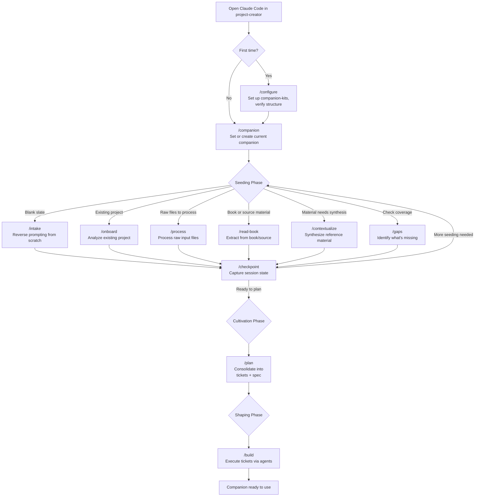
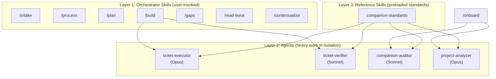
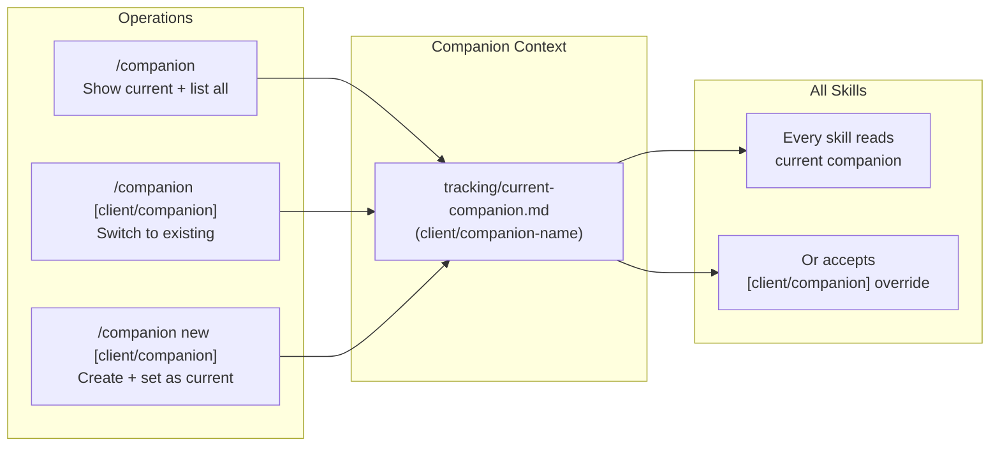

# Companion Guide

How to use Project Creator to build AI companions through reverse prompting. This is the operational playbook — what to do, when, and which commands to use.

---

## Command Quick Reference

### Setup
```
/configure                                        First-run: verify structure, set up kits
/companion                                        Show current companion + list all
/companion [client/companion]                     Switch to existing companion
/companion new [client/companion]                 Create new companion, set as current
```

### Seeding
```
/intake                                           Reverse prompting from scratch
/intake [persona]                                 Start with a known persona (accelerator)
/intake [persona] [client/companion]              Persona + companion override
/onboard                                          Analyze existing project, fill gaps
/onboard [client/companion]                       Onboard specific companion
/process                                          Process raw input files into context
/process [client/companion]                       Process for specific companion
/read-book [kindle-url]                           Read book via Kindle Cloud Reader
/read-book [kindle-url] [client/companion]        Read into specific companion's reference/
/read-book --library [org] [kindle-url]           Read into org library (companion-neutral)
/read-book --library [org] [subject] [kindle-url] Read into org library with subject category
/contextualize [book-search-term]                 Synthesize org library notes for companion
/contextualize [book-search-term] [client/companion]  Synthesize for specific companion
/gaps                                             Check what's missing against standards
/gaps [client/companion]                          Check gaps for specific companion
/checkpoint                                       Capture session state
/checkpoint [client/companion]                    Checkpoint specific companion
```

### Cultivation
```
/plan                                             Consolidate context into spec + tickets
/plan [client/companion]                          Plan for specific companion
```

### Shaping
```
/build                                            Execute tickets via agents
/build [client/companion]                         Build specific companion
```

### Kit Management
```
/capture-capability public [name] [description]   Extract capability to public kits
/capture-capability client [name] [description]   Extract capability to client kit
```

---

## The Companion Lifecycle

Every companion moves through three phases. Some need days of seeding; others arrive with rich source material and move quickly to planning.



### What the loop looks like in practice

A typical companion build spans 3-10 sessions. You might:

- `/companion new acme/api-companion` then `/intake` to start reverse prompting, then `/checkpoint`
- `/companion acme/api-companion` then `/process` a requirements doc, then `/gaps` to see what's missing, then `/checkpoint`
- `/read-book` a methodology book, then `/contextualize` to synthesize it into reference material, then `/checkpoint`
- `/gaps` reveals missing constraints, `/intake` to draw them out through questions, then `/checkpoint`
- `/plan` consolidates everything into a spec with tickets, ready for `/build`
- `/build` dispatches agents to execute tickets, updates Linear, produces the companion

The loop is deliberate. Each command reads the current companion's context files, so later commands build on earlier ones. `/checkpoint` externalizes session state so nothing is lost.

---

## The Three Phases

### Phase 1: Seeding — Draw Out the Raw Material

The goal is extraction, not generation. The user has tacit knowledge about what this companion should do. Seeding commands draw it out.

| Situation | Command | What happens |
|-----------|---------|-------------|
| Starting from nothing | `/intake` | Reverse prompting — asks questions one at a time to build requirements, constraints, decisions |
| Existing Claude Code project | `/onboard` | Analyzes what exists, reports FOUND / MISSING / RECOMMENDATIONS, fills gaps |
| User has documents (specs, transcripts, notes) | `/process` | Processes raw files into structured context |
| Book or reference source | `/read-book` | Extracts methodology, patterns, techniques into reference material |
| Reference material needs synthesis | `/contextualize` | Transforms raw reference into companion-specific guidance |
| Need to assess completeness | `/gaps` | Compares current context against companion standards, surfaces what's missing |
| End of session | `/checkpoint` | Captures decisions, open questions, and next steps |

**The quality extraction pattern:** Raw material (conversations, documents, books) contains a "quality" — the portable thing that makes this companion distinct. Seeding draws it out; it doesn't invent it.

### Phase 2: Cultivation — Consolidate Into a Plan

Once seeding has produced enough context (requirements, constraints, decisions, reference material), cultivation consolidates everything into an actionable build plan.

| Command | What it produces |
|---------|-----------------|
| `/plan` | Implementation spec with tickets, file inventory, dependency graph — everything `/build` needs |

`/plan` reads all context files, identifies what Claude Code configuration components are needed (CLAUDE.md, skills, agents, rules, hooks, settings.json), and produces a tickets.yaml with sequenced work.

### Phase 3: Shaping — Execute the Plan

Shaping dispatches agents to build the companion. Each ticket becomes a unit of work executed in isolation.

| Command | What it produces |
|---------|-----------------|
| `/build` | Executes tickets via ticket-executor agents, tracks progress in Linear, verifies completion |

---

## The Three-Layer Architecture

Project Creator uses a strict separation between orchestration, execution, and standards.



| Layer | What | Why |
|-------|------|-----|
| **Orchestrator skills** | User-invoked commands that collect inputs and dispatch work | Keeps the main conversation focused on dialogue with the user |
| **Agents** | Isolated subprocesses that do heavy file creation/verification | Prevents context bloat; agents read standards and produce artifacts independently |
| **Reference skills** | `companion-standards` — the authoritative spec for companion structure | Every agent preloads these so they produce consistent, correct output |

**Why agents?** Building a companion touches dozens of files (CLAUDE.md, skills, agents, rules, hooks, settings.json, context files). Doing all that in the main conversation would overwhelm the context window. Agents do the heavy lifting in isolation and return structured results. The orchestrator validates inputs, dispatches agents, and presents output for user approval.

---

## Companion Structure

Every companion follows this standard layout:

```
companions/[client]/[companion]/
├── CLAUDE.md                     # Companion identity + configuration
├── companion-guide.md            # Operational playbook (this format)
├── context/
│   ├── requirements.md           # What the companion does
│   ├── constraints.md            # What it must not do
│   ├── decisions.md              # Design choices with rationale
│   └── questions.md              # Open questions
├── reference/                    # Contextualized library materials
├── docs/plans/
│   ├── claude-code-config-spec.md  # Implementation spec
│   ├── tickets.yaml              # Build tickets
│   └── build-progress.md         # Execution tracking
├── templates/                    # Companion-specific templates
└── .claude/
    ├── skills/                   # Workflow skills
    ├── agents/                   # Agent definitions
    ├── rules/                    # Path-scoped conventions
    ├── hooks/                    # Session rules
    └── settings.json             # Hook + permission config
```

Each companion has its own independent git repository.

---

## Managing Companions



All skills operate on the current companion by default. You can override with an explicit `[client/companion]` argument.

---

## Cross-Project Relationships

| Project | Relationship |
|---------|-------------|
| **Companion kits** | Reusable building blocks (personas, capabilities) that Project Creator composes into companions. Public kits committed; private kits git-ignored. Use `/capture-capability` to extract patterns from built companions into kits. |
| **Built companions** | Each companion is an independent Claude Code project with its own git repo, CLAUDE.md, skills, agents, and rules. |
| **Linear** | Tracks build execution. Each `/build` run creates/updates tickets in Linear. |
| **Methodology** | `methodology.md` is the deep reference for reverse prompting, failure recovery, and meta-project patterns. |

---

## The Governing Principle

**Draw out, don't generate.** The user has the domain knowledge — what makes this companion distinct. Project Creator's job is to ask the right questions, push for specificity, extract the "quality," and structure it into a working Claude Code project.

When reverse prompting: one question at a time. Challenge vagueness. Push for concrete examples. The initial answer is never the final answer.

---

## Key Principles

- **Reverse prompt before building.** The user's expertise is the primary input. Draw it out through questions, not assumptions.
- **One question at a time.** During seeding, ask a single focused question. Wait for the answer. Build on it.
- **Checkpoint before you leave.** Context lives in files, not conversation history. Run `/checkpoint` at the end of every session.
- **Start wrong, iterate to right.** The first version of anything is never the final version. Build the feedback loop.
- **Git isolation.** `companions/` is git-ignored. Each companion has its own independent repo.
- **Three layers, strict separation.** Skills dispatch agents; agents preload reference skills. Don't collapse the layers.
- **Verify after agents claim completion.** Always do a final file inventory. Agents can claim success without delivering.

---

**Last Updated**: March 4, 2026
